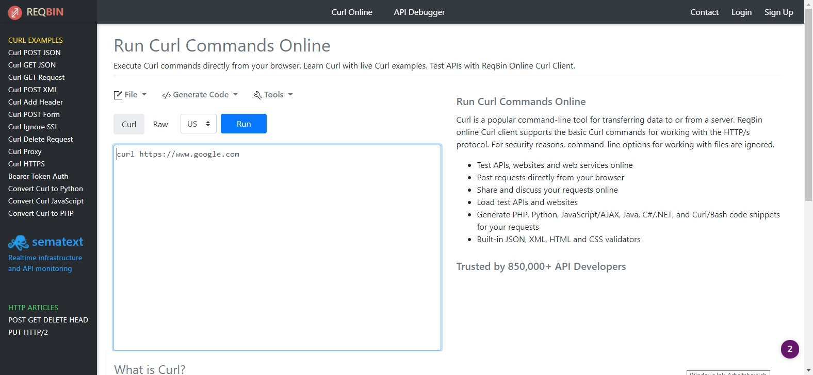
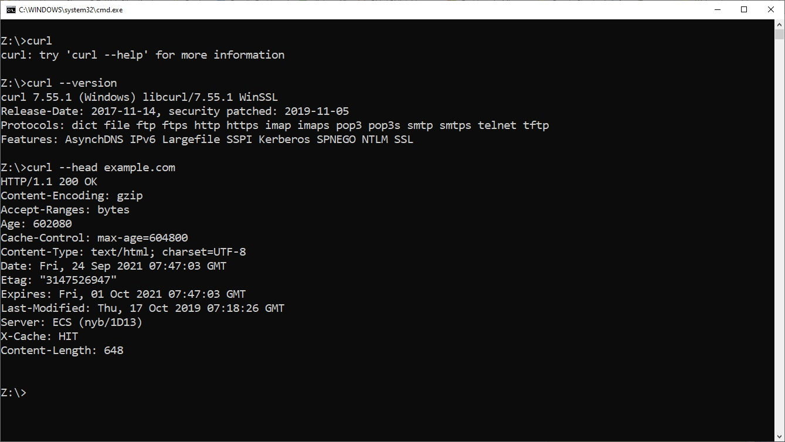

# How to use CURL - Some Examples
##### Last update: 24/9/21 dbe

## Background
Curl (*Client for URLs*) is a popular command line tool for doing all sorts of **URL manipulations** and transferring data to or from a server trough **HTTP requests.** 
We  assume that you know how to invoke *curl --help* or *curl --manual* to get basic information about it.

HTTP is the protocol used to fetch data from web servers. It is a very **simple protocol that is built upon TCP/IP**. The protocol also allows information to get sent to the server from the client using a few different methods. HTTP is plain ASCII text lines being sent by the client to a server to request a particular action, and then the server replies a few text lines before the actual requested content is sent to the client.

**The client**, curl, sends a HTTP request. The request contains a method (like GET, POST, HEAD etc), a number of request headers and sometimes a request body. **The HTTP server** responds with a status line (indicating if things went well), response headers and most often also a response body. The "body" part is the plain data you requested, like the actual HTML or the image etc.

## Curl Online 
Execute Curl commands directly from your browser. Learn Curl with live Curl examples.
**ReqBin online Curl** client supports the basic Curl commands for working with the HTTP/s protocol.
Try it out https://reqbin.com/curl

## Curl Command Line
Execute Curl commands directly from your browser. Learn Curl with live Curl examples.
The [curl project](https://curl.se/download.html) provides source packages for different platforms/os. Other packages are kindly provided by external persons and organizations.

In Windows 10 you can use Curl directly from your Command Line, see [How To Check Win10 for Curl](https://youtu.be/jwJv8QsWVag)

### Some Command Line Examples
* xxx
´´´
curl xxx
´´´

* yyy

* zzz

